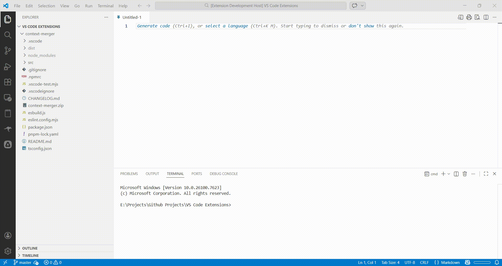

# Context Merger

**Context Merger** is a Visual Studio Code extension that helps you quickly merge multiple files and folders into a single, well-structured text file. It's perfect for:

- Sharing project context with LLMs (ChatGPT, Claude, Gemini, Copilot)
- Code reviews
- Documentation
- Debugging sessions

Instead of manually opening, copying, and pasting files, Context Merger lets you right-click any selection in the VS Code Explorer and instantly generate a unified file containing all relevant source code, organized and ready to use.

## Features

- Merge multiple files and folders into a single Markdown file
- Automatically adds file headers and preserves folder structure
- Ignores common unwanted directories: `node_modules`, `.git`, `dist`, `build`, `.next`, `out`
- Shows total files, character count, and estimated tokens (useful for LLM input limits)
- Supports any file type

## Demo



## Usage

1. Select one or more files/folders in the VS Code Explorer.
2. Right-click and choose **Merge into Single File**.
3. A new Markdown file opens with all selected content merged.
4. A summary shows total files, total characters, and estimated token count.

## Example Output

````markdown
## myProject/src/index.ts
```text
console.log("Hello World");
```

## myProject/src/utils/helpers.ts

```text
export function add(a, b) {
  return a + b;
}
```

````