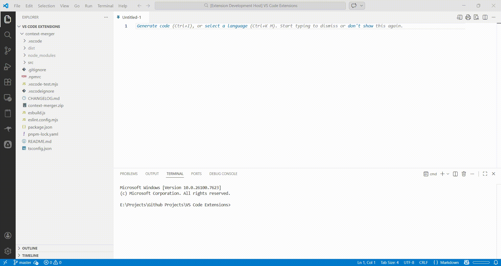

# Context Merger

**Context Merger** is a Visual Studio Code extension that helps you quickly merge multiple files and folders into a single, well-structured text file. It's perfect for:

- Sharing project context with LLMs (ChatGPT, Claude, Gemini, Copilot)
- Code reviews
- Documentation
- Debugging sessions

Instead of manually opening, copying, and pasting files, Context Merger lets you right-click any selection in the VS Code Explorer and instantly generate a unified file containing all relevant source code, organized and ready to use.

## Features

- Merge multiple files and folders into a single Markdown file
- Automatically adds file headers and preserves folder structure
- Filters to common code/document file types by default
- Optionally include any file type via a setting toggle
- Add custom extra file extensions to include
- Configurable ignored file/folder names (defaults include `node_modules`, `.git`, `dist`, `build`, `.next`, `out`)
- Optional cleanup for extra blank lines
- Optional comment stripping before merge
- Shows total files, character count, and estimated tokens (useful for LLM input limits)

## Demo



## Settings

- `contextMerger.disableFileTypeFiltering` (boolean, default: `false`)
  - When enabled, includes all file types.
- `contextMerger.additionalFileTypes` (string array, default: `[]`)
  - Extra extensions to include in addition to built-in common code types (for example: `.svg`, `.proto`).
- `contextMerger.ignoredFilesFolders` (string array)
  - File/folder names to skip during traversal.
- `contextMerger.skipExtraBlankLines` (boolean, default: `true`)
  - Collapses extra blank lines in merged output.
- `contextMerger.removeComments` (boolean, default: `false`)
  - Removes comments from file contents before merge.

## Usage

1. Select one or more files/folders in the VS Code Explorer.
2. Right-click and choose **Merge into Single File**.
3. A new Markdown file opens with all selected content merged.
4. A summary shows total files, total characters, and estimated token count.

## Example Output

````markdown
## myProject/src/index.ts
```text
console.log("Hello World");
```

## myProject/src/utils/helpers.ts

```text
export function add(a, b) {
  return a + b;
}
```

````
